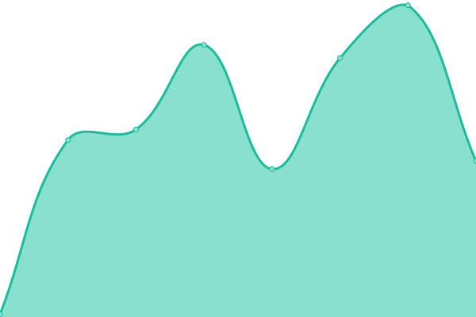
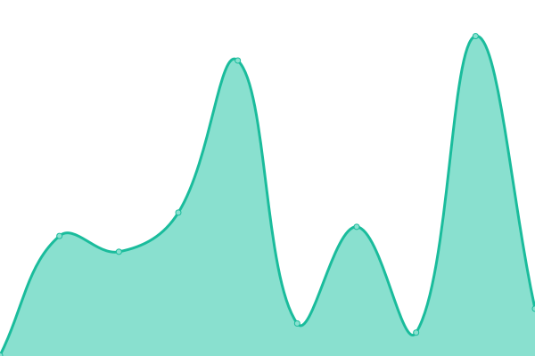
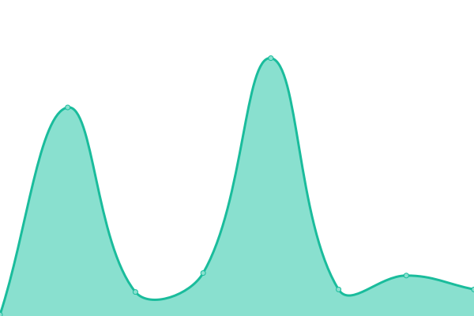

# [📈 Live Status](https://UmbHost.github.io/Status-Page): <!--live status--> **🟩 All systems operational**

This repository contains the open-source uptime monitor and status page for [UmbHost](https://umbhost.net), powered by [Upptime](https://github.com/upptime/upptime).

With [Upptime](https://upptime.js.org), you can get your own unlimited and free uptime monitor and status page, powered entirely by a GitHub repository. We use [Issues](https://github.com/UmbHost/Status-Page/issues) as incident reports, [Actions](https://github.com/UmbHost/Status-Page/actions) as uptime monitors, and [Pages](https://UmbHost.github.io/Status-Page) for the status page.

<!--start: status pages-->
<!-- This summary is generated by Upptime (https://github.com/upptime/upptime) -->
<!-- Do not edit this manually, your changes will be overwritten -->
<!-- prettier-ignore -->
| URL | Status | History | Response Time | Uptime |
| --- | ------ | ------- | ------------- | ------ |
|  [UmbHost Website (UK)](https://umbhost.net) | 🟩 Up | [umb-host-website-uk.yml](https://github.com/UmbHost/Status-Page/commits/HEAD/history/umb-host-website-uk.yml) | 

 167ms
     
 | 

<a href="https://status.umbhost.net/history/umb-host-website-uk">99.58%</a>
    

|  [UmbHost Website (US)](https://us.umbhost.net) | 🟩 Up | [umb-host-website-us.yml](https://github.com/UmbHost/Status-Page/commits/HEAD/history/umb-host-website-us.yml) | 

 97ms
     
 | 

<a href="https://status.umbhost.net/history/umb-host-website-us">99.69%</a>
    

|  [UmbHost Website (EU)](https://eu.umbhost.net) | 🟩 Up | [umb-host-website-eu.yml](https://github.com/UmbHost/Status-Page/commits/HEAD/history/umb-host-website-eu.yml) | 

 199ms
     
 | 

<a href="https://status.umbhost.net/history/umb-host-website-eu">99.66%</a>
    

|  [UmbHost Website (AU)](https://eu.umbhost.net) | 🟩 Up | [umb-host-website-au.yml](https://github.com/UmbHost/Status-Page/commits/HEAD/history/umb-host-website-au.yml) | 

 49ms
     
 | 

<a href="https://status.umbhost.net/history/umb-host-website-au">99.66%</a>
    

|  [UmbHost Store](https://my.umbhost.net/store) | 🟩 Up | [umb-host-store.yml](https://github.com/UmbHost/Status-Page/commits/HEAD/history/umb-host-store.yml) | 

 1132ms
     
 | 

<a href="https://status.umbhost.net/history/umb-host-store">99.67%</a>
    

|  [UmbCheckout Documentation](https://docs.umbcheckout.net) | 🟩 Up | [umb-checkout-documentation.yml](https://github.com/UmbHost/Status-Page/commits/HEAD/history/umb-checkout-documentation.yml) | 

 177ms
     
 | 

<a href="https://status.umbhost.net/history/umb-checkout-documentation">100.00%</a>
    

|  [UmbCheckout Demo](https://demo.umbcheckout.net) | 🟩 Up | [umb-checkout-demo.yml](https://github.com/UmbHost/Status-Page/commits/HEAD/history/umb-checkout-demo.yml) | 

 691ms
     
 | 

<a href="https://status.umbhost.net/history/umb-checkout-demo">100.00%</a>
    

<!--end: status pages-->

[**Visit our status website →**](https://UmbHost.github.io/Status-Page)

## 📄 License

- Powered by: [Upptime](https://github.com/upptime/upptime)
- Code: [MIT](./LICENSE) © [Anand Chowdhary](https://anandchowdhary.com), supported by [Pabio](https://pabio.com)
- Data in the `./history` directory: [Open Database License](https://opendatacommons.org/licenses/odbl/1-0/)
